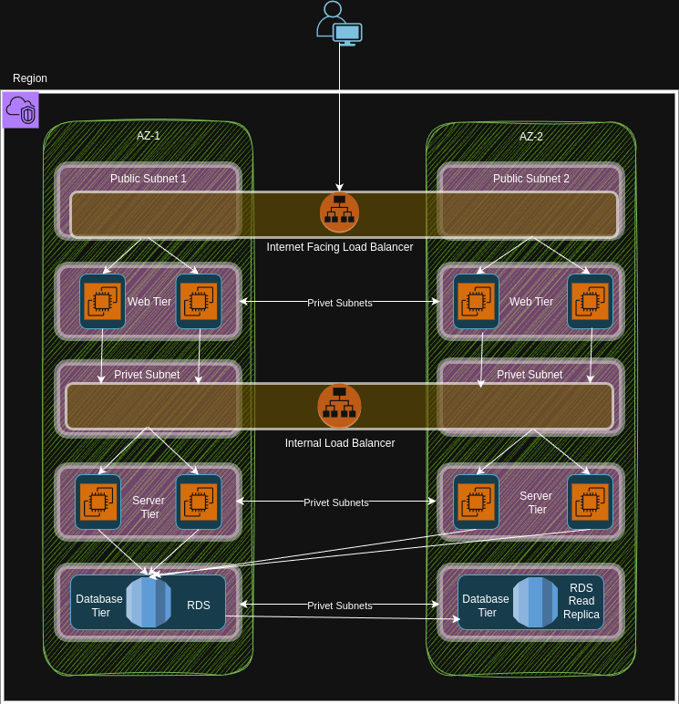

# AWS 3-Tier Architecture 🚀🌐

## 📖 Overview

This repository demonstrates a classic **3-Tier Web Application Architecture** deployed on AWS:

- **Web Tier**: Frontend hosting (e.g., HTML/JS via EC2 or S3).
- **Application Tier**: Node.js backend logic (see `index.js`).
- **Database Tier**: RDS or similar, not included in this repo.

🔸 This design ensures **scalability**, **security**, and **high availability** using AWS best practices for separation of concerns and modular cloud deployments.

## 🗂️ Project Structure

| File/Folder         | Purpose                                         |
|---------------------|------------------------------------------------|
| `index.html`        | Main frontend entry point (Web Tier)            |
| `index.js`          | App backend logic (App Tier, Node.js)           |
| `package.json`      | Node.js dependency management                   |
| `Images/`           | Architecture diagrams and illustrative assets   |

## 🏗️ Typical Architecture Components

- **VPC** with public/private subnets
- **Elastic Load Balancer**: Distributes traffic
- **Auto Scaling Group**: Ensures high availability and scalability
- **EC2 instances**: Hosts Web/App tiers
- **RDS Instance**: Managed database (not included in this repo)

_Refer to the architecture diagram in the Images folder for a visual!_

## 🚀 Step-by-Step Setup Guide

Below are the **basic steps to deploy an AWS 3-Tier Architecture** from scratch. For production, always follow AWS security and best-practices documentation.

### 1. **Set Up VPC & Subnets**
- Go to AWS VPC Console.
- Create a new **VPC** (e.g., 10.0.0.0/16).
- Add **public** and **private subnets**:
    - Public: For Load Balancer & Web Tier EC2.
    - Private: For Application Tier EC2 & RDS.

### 2. **Route Tables & Gateways**
- Attach an **Internet Gateway** to your VPC for public subnet access.
- Configure **Route Tables**:
    - Public subnet routes internet traffic via the gateway.
    - Private subnet routes remain internal (optionally add NAT Gateway for outbound-only).

### 3. **Deploy EC2 Instances**
- Launch EC2 instances:
    - Web Tier: In public subnet.
    - Application Tier: In private subnet.
- Install your frontend and backend code.

### 4. **Configure Security Groups**
- Web Tier: Allow HTTP/HTTPS from the internet, restrict SSH as needed.
- App Tier: Allow traffic only from Web Tier or Load Balancer.
- Database Tier: Allow traffic only from App Tier or specific sources.

### 5. **Set Up Elastic Load Balancer**
- Go to EC2 > Load Balancers.
- Create an **Application Load Balancer** in public subnets.
- Register Web/App Tier EC2 instances as targets.
- Update DNS records to point your domain to the Load Balancer DNS.

### 6. **Enable Auto Scaling Group**
- Create an **Auto Scaling Group** for your EC2 instances (Web/App Tier).
- Define scaling policies based on CPU, Network, or custom alarms.
- Attach the group to your Load Balancer for seamless scaling.

### 7. **Add RDS Database**
- Open RDS service and create a new DB instance (e.g., MySQL/PostgreSQL).
- Place RDS in private subnet (Database Tier).
- Secure with proper subnet groups and security group rules (limit access to App Tier).

### 8. **Connect & Test**
- Update application configs (`index.js`) to point to your RDS endpoint.
- Test full connectivity from frontend to backend to database.
- Use provided architecture diagrams for reference.

## 🛠️ Getting Started

1. **Clone this repo**
2. Deploy the web and app tiers using AWS EC2 or your preferred method
3. Set up networking and database as shown above
4. Update backend and DB configs in `index.js` as per your AWS resources

## 📸 More Visuals

## 💡 Contributing

Open for suggestions and PRs! Create issues for bugs or improvements.
